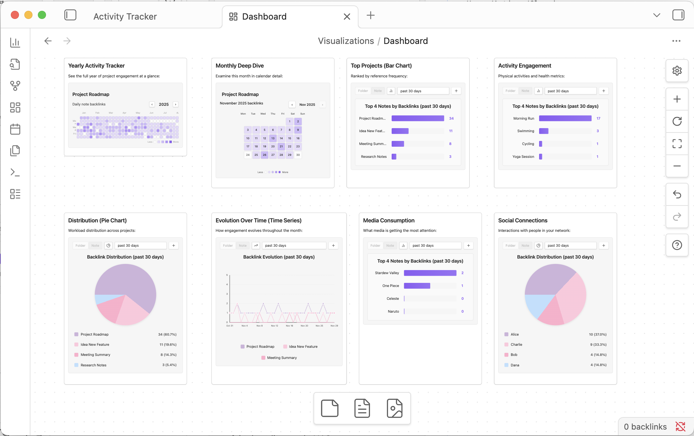
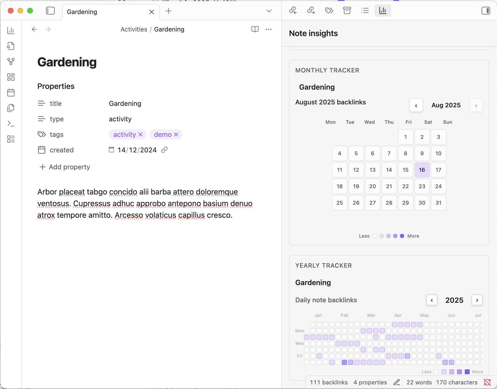
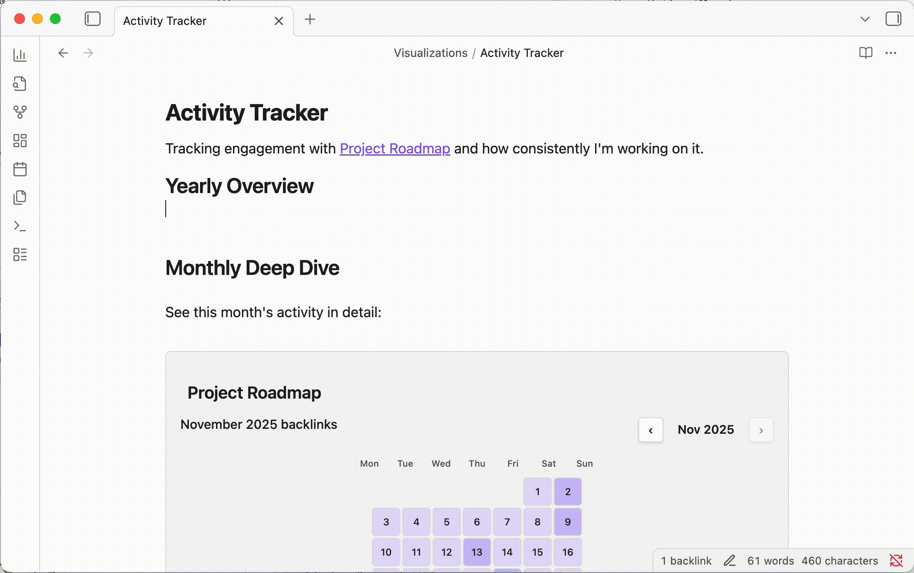
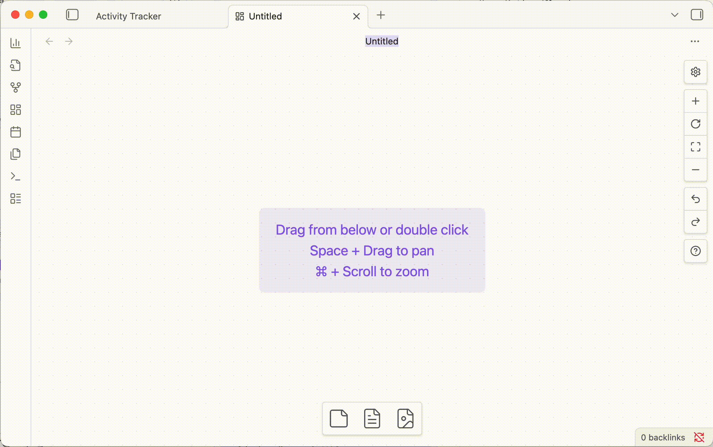
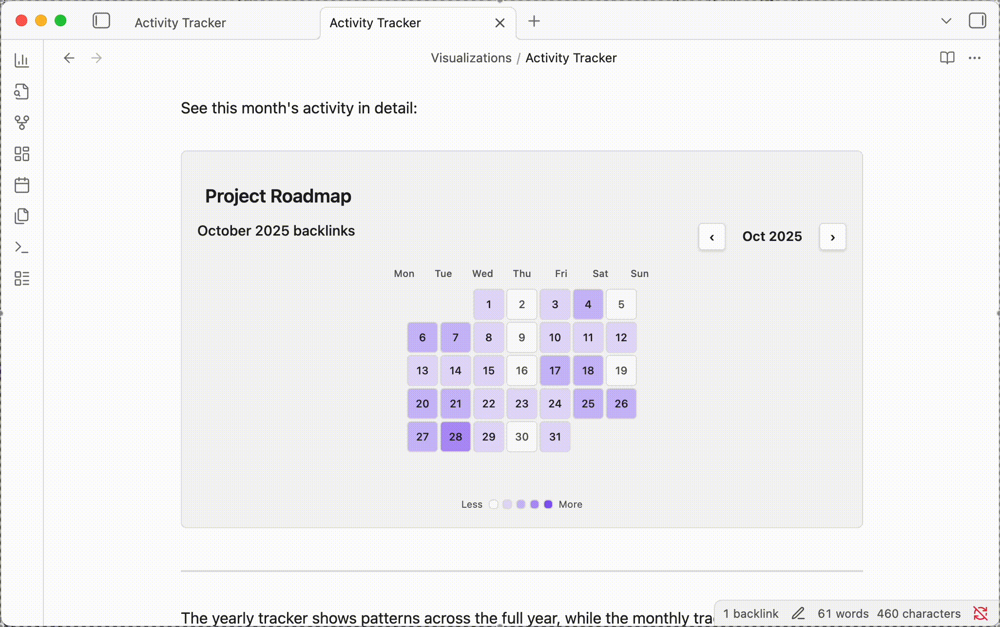

# Journal Visualizer

Effortless insight about your Daily Notes.
No tinker, no setup, just click and see.

## Important note

This plugin assumes you are journaling using daily notes, and using links from your daily notes to other notes in your vault to log activities, moods, symptoms, interactions with persons, piece of media, tasks, projects, etc...

If you're not doing that, this plugin probably won't be very useful to you.

## How to use

> 💡 You can download the demo vault zip from the releases page to try it out with sample data before installing to your own vault!

If you want to try the plugin in your own vault, follow these steps:
1. Install the plugin
	- Ideally from obsidian community plugins if available
	- Or download the latest .zip to `your-vault/.obsidian/plugins/` and unzip there
2. Open a note or a canvas node in edit mode where you want to add a visualization.
3. Right click, and select your desired viz from contextual menu.

## Features

### Note insight view

This plugin adds a new view to Obsidian. It gives you insight about currently active note.
To open it for the first time, click the chart icon in the ribbon on the left.

### Add a viz to a note...

### ...or to a canvas node

### Available visualizations

- Monthly tracker
- Yearly tracker
- Counter (has several display modes)
	- Plain number
	- Pie chart
	- Top items
	- line graph

### Goodbye codeblocks, hello buttons and knobs!

It's all just codeblocks... but you don't have to edit them or learn how they work.

Adding a viz to a note or canvas auto-creates the relevant codeblock for you.
Interacting with the viz to change period, or watched notes or folders, auto-updates the codeblock too.

### Colors are customizable too!

See the plugin's settings tab for more.

## The problem this plugin solves - why

This plugin helps you figure out *how often* you link to notes from your daily notes.

If you're like me, and use Obsidian for personal journaling, knowledge management, or project planning, you probably have hundreds or thousands of notes. Obsidian is great for linking notes together, and helping you find specific piece of information, as long as you or organize it in a way that works for you.

However, as your vault grows, it becomes harder to get a high-level overview of your notes, and how they relate to each other. 
Sure the graph view can give you a satisfying visual representation of your second brain, but it doesn't really help you figure out *how often* you link to notes from your journal.

## Future plans

- Fix a ton of tiny bugs
- fix a ton of minor UI and UX issues
- add a heatmap and correlation viz ➡️ figure out correlations between moods, symptoms, activities, media consumption, etc...
- add a "trends" mode to existing viz ➡️ show variation compared to previous period
- probably fix an other ton of tiny bugs...
- probably fix more minor UI and UX issues...

## About

I'm french dev and music producer based in France.

This plugin is inspired by the way I journal, and the tools I wish I had when I started with Obsidian. It's not meant to be a one-size-fits-all solution. It's clearly opinionated, and tailored to my own journaling style.

Think of this as a personal plugin project made public, rather than a polished product.

If you find it useful, or just want to chat, feel free to contact me via bluesky or email (see my profile).

## Credits

- anilist - used as inspiration for UI design
- Obsidian Link Nodes In Canvas - used as inspiration for technical implementation https://github.com/Quorafind/Obsidian-Link-Nodes-In-Canvas
- Cannoli - used as inspiration for technical implementation https://github.com/DeabLabs/cannoli
