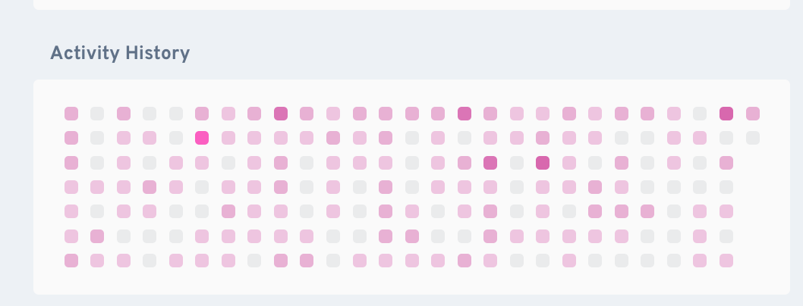

Version: 3.0

## Ideation
- adds a new note insight component that displays a yearly tracker of backlinks from daily notes to the active note
- it should display a yearly tracker, git tracker style, or anilist tracker style, showing which days in a selected year the active note was linked from a daily note
- users should be able to navigate between different years to see historical tracking data
- it should display a monthly tracker in same fashion as yearly tracker.



## Requirements

### Requirement 1 — Yearly tracker display with year navigation
**User Story:** As a note author, I want to see a yearly tracker in the note insights panel that highlights the days in a selected year when the active note was linked from daily notes, so that I can quickly visualize its relevance over time for any year.

### Requirement 2 — Year navigation controls
**User Story:** As a note author, I want to navigate between different years in the yearly tracker (previous/next year buttons and/or year selector), so that I can view historical tracking data and see how my note's relevance has changed over time.

### Requirement 3 - Additional info on hover
**User Story:** As a note author, I want to see a short summary about the backlinks when I hover over a day in the yearly tracker, so that I can understand how many backlinks were made from what line of daily notes on that specific day. It should use a simple aria hidden tooltip so it stays discrete.

### Requirement 4 - shortcut to watched note
**User Story:** As a note author, I want to be able to click on the title of the note being tracked in the yearly tracker component header to quickly open that note, so that I can easily access and edit the note without needing to search for it manually.

### Requirement 5 - shortcut to journal entry
**User Story:** As a note author, I want to be able to click on a day in the yearly tracker that has backlinks to quickly open the corresponding daily note for that day, so that I can easily review the context in which my note was linked.

### Assumptions and rules
- the yearly tracker displays all days from January 1st to December 31st of the selected year (defaults to current year)
- users can navigate between years using previous/next year buttons and/or a year selector dropdown
- the year navigation should have reasonable bounds (e.g., from when daily notes first appeared in the vault to current year + 1)
- days that have at least one backlink from a daily note to the active note are highlighted (e.g., colored square)
- days without backlinks are shown in a neutral style (e.g., gray square)
- the colored square intensity or style can indicate the number of backlinks (e.g., darker color for more backlinks)
- the intensity scale is linear, with 1 backlink being the lightest color and the maximum backlinks in a single day being the darkest color
- the shade amplitude is capped at a reasonable maximum (e.g., 5 backlinks) to avoid overly dark squares
- when switching years, the tracker should maintain the same visual style and hover functionality
- the colors used for highlight should rely exclusively on Obsidian theme variables to ensure proper theming support


## Design

High-level flow:
- similar to FEA001, we only need to build a new component in the Note Insights view.
- If additional logic is deemed required during implementation, it should be encapsulated in new or existing core utility classes.

Useful ressources:
- [Obsidian Developers doc](https://docs.obsidian.md/Home)
- [Obsidian Views API](https://docs.obsidian.md/Plugins/Plugin+API)
- [Obsidian guide to use react in a plugin](https://docs.obsidian.md/Plugins/Getting+started/Use+React+in+your+plugin)

## Classes and Interfaces
- **YearlyTrackerComponent**: A class that renders the yearly tracker UI in the Note Insights panel with year navigation capabilities.
- **YearNavigationControls**: Navigation interface for switching between years (previous/next buttons and/or year selector).

## Where This Component Appears

The Yearly Tracker component can be displayed in multiple contexts:

### Note Insights Panel (FEA001)
- Automatically appears in the right sidebar "Note insights" view
- Shows data for the currently active note
- Updates automatically when switching notes

### Code Blocks in Markdown Notes (FEA004)
- Can be embedded using `note-insight-yearly` code block type
- Allows watching any note (not just the active note)
- State (selected year) persists across sessions
- Auto-updates when watched note's backlinks change

**Code block syntax:**
```note-insight-yearly
notePath: path/to/note.md
year: 2024
```

### Handling click events

As per Requirements 4 and 5, the YearlyTrackerComponent should handle click events internally to open notes:
1. **imports the Obsidian `App` instance** in its constructor
2. **Handle note opening internally** when the user clicks on elements


### Canvas Text Nodes (FEA004)
- Same functionality as markdown code blocks
- Embeddable in canvas text nodes using identical syntax
- State persists in canvas JSON

### Editor Context Menu (FEA004)
- Can be inserted via "Add Yearly Tracker from Vault" context menu option
- Opens note selector modal to choose note to watch
- Inserts code block at cursor position

For complete details on embedding and context menu usage, see [FEA004: Embed Note Insight Component](FEA004-embed-note-insight-component.md).

For an overview of all components and their capabilities, see the [Component Capabilities Matrix](component-capabilities-matrix.md).
